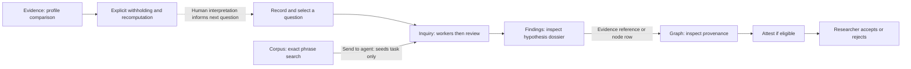

# Cohort UI: a beginner's guide for the PNC presenter

> Historical draft from 7 September 2026. For the current presentation and interface, use the [presenter walkthrough](presentation/walkthrough.md) and [cue card](presentation/presenter-cue-card.md). Earlier implementation descriptions and speaking sequences may be outdated.

Draft, 7 September 2026. **Source-grounded; not browser-verified.** Screenshot
slots below are requirements for a later browser pass, not evidence that the
screens have been captured. This guide contains no real corpus excerpts or
results and does not report a paid run. It describes the current frontend and
API alongside the cautions in [the speaker's canvas](pnc-speaker-canvas.md).

## Start with the question, not the graph

Cohort is a research record and an instrument for examining evidence. It does
not decide who translated a text. A useful introductory sentence is: “We ask a
question, let agents retrieve and propose, inspect what supports their proposals,
and leave acceptance to the researcher.”

Five tabs divide those jobs. **Inquiry** records a question and starts agent
work. **Findings** makes the resulting hypotheses readable. **Graph** shows
relationships and opens the researcher’s decision controls. **Corpus** retrieves
words from source material. **Evidence** compares short-string profiles and
shows where those comparisons come from. Graph and Findings are always listed;
the server's configured capabilities determine whether the other tabs appear.
A missing tab therefore need not mean a broken installation.

The default landing tab is Graph. The tab introductions can be collapsed; the
browser remembers each choice. The Evidence tab also has its own separate
“how to read this” section. Collapse repeated explanations during a rehearsal
only after learning what they say. One current Graph introduction is stale: it
describes a fixed layout, whereas the implemented graph uses draggable,
force-directed physics.

## Inquiry: give agents a bounded research task

**Input:** a research question, what would count as an answer, a selected roster,
and a budget. **Output:** a recorded run, tool activity, possible proposals and
citations, review outcomes, and refusals. Starting a run is the action here that
can incur model charges. Merely reading the tab is not a model call.

Under **What is being asked**, choose **Ask a question**. Complete **The question**
and **What would count as an answer**, then choose **Record it**. This writes a
research question and selects it. For a synthetic rehearsal, an example is:
“Where does the phrase ABC occur in this fixture?” with “Located occurrences
within the fixture; occurrence alone does not establish historical dependence.”
A question is an agenda, not an assertion of a result. Clicking an existing
question selects it; clicking the selected question deselects it.

Auto mode displays the server's actual plan: worker/reviewer roles, methods and
models. **Inquire (N agents)** requires a selected question. The number of seats
comes from configuration, so do not promise a fixed number. Workers can search
and propose; reviewers operate after worker output exists. An agent cannot
review its own claim, and the model-family separation rule prevents treating
two nominally different agents with the same family as independent reviewers.

**Customize the roster…** exposes agent IDs, **Task**, **Model**, **Corpus scope**
and **Method**, with **+ Add agent**, **+ Add reviewer**, **remove**, and **back to
auto**. Scope and method are recorded and included in instructions; do not
present a free-text scope field as a separately enforced source-access boundary.
Custom mode can run tasks without a question. For this presentation, retaining
a recorded question makes the intellectual purpose easier to follow.

Set **Budget (USD)** before **Inquire** or **Start run**. Although the UI calls
this a hard cap, the implementation checks recorded spend before new calls and
accounts for responses afterward. In-flight calls can exceed the threshold.
Describe it as a configured spending threshold, not a guaranteed final bill.
**Stop after this turn** requests a stop; it does not promise instantaneous
cancellation of a call already underway.

The report shows state, elapsed time, recorded spend, model-call counts,
per-agent tool results and refusals. **Recorded runs** lists durable run
summaries from the event log; the current component does not make those rows a
full historical-trace viewer. A running inquiry holds the graph writer lock,
so wait until it settles before making researcher decisions.

## Findings: read the proposals before judging them

**Input:** hypotheses and related records already in the graph. **Output:**
readable dossiers, verification information, and routes into graph records.
Opening Findings does not accept a hypothesis.

The first list is **Hypotheses**, newest first rather than sorted by support.
Click the hypothesis text to expand its dossier. Status and assurance badges,
attesting-passage counts, witness counts and shared-descent indications answer
different questions. A large count alone is not confidence. Two passages can
come from the same witness, and two witnesses can have a recorded relationship
that limits their independence.

A dossier may show derivation, selection risks, alternatives, prior-art searches,
a prospective query and its result, cited excerpts, and latest verifications.
Absent fields are not invented by the panel. The **Machine** and **Does not
establish** wording is useful on stage: a successful location check does not
make the interpretation correct. Clicking an evidence reference switches to
Graph and selects that passage. Clicking a Citable or Rejected row likewise
opens its node in Graph. The hypothesis header itself expands the dossier; it
is not a direct Accept control.

**Citable** contains accepted nodes. **Rejected** retains rejected nodes and
reasons, making discards part of the research output. These lists are the
natural ending for a demonstration of researcher authority, but only use an
actual accepted example if its recorded history supports that claim.

**Integrity** checks whether payload hashes match and whether replaying the log
reproduces the projection. The current component runs these checks on mount and
provides **Re-check**. Despite the label **Rebuild from the log**, the GET check
compares a replay; it is not a button to overwrite the live graph. These checks
concern record consistency, not the historical truth of an assertion.

## Graph: follow provenance and make researcher decisions

**Input:** recorded nodes and relations. **Output:** a navigable picture and a
selected-node inspector. A node is a record; an edge is a relationship between
records. Drag nodes to separate them, drag the view to move around, and zoom.
Click a node to open its inspector; click it again, use the close control, or
press Escape to dismiss it. Labels are shortened on the canvas, so use the
inspector when explaining a complete assertion.

Fill colour distinguishes evidence conditions and types. Border styling carries
status: proposed nodes have dashed borders and accepted nodes heavier borders.
Do not equate a green claim with researcher acceptance. Consult the visible
legend for relations that add support and relations that discount it. The
**refused writes** control opens the reasons the graph declined operations;
the adjacent statistics and settings provide counts, theme controls and audit
visibility. A truncated-view banner means the canvas is not the whole graph.

The inspector shows payload, support, verification, incoming and outgoing
relations, and authorship. Clicking a related node follows that connection;
clicking an author exposes contribution history. On a write-enabled server,
**Researcher decision** offers **Attest** for a proposed node, **Accept** only for
an attested node, **Reject** with a reason, or **Reopen** for a rejected node
with a reason. These are persistent actions. Read-only mode omits decision
controls.

Attest runs the graph's mechanical promotion check. It can refuse an unsupported
claim; it is not a shortcut that certifies interpretation. Acceptance cannot
skip attestation. A researcher can deliberately run the available check, but
do not use it to manufacture a successful ending for a trace whose reviewer
withheld attestation.

Existing relations can have **retract** or **restore** controls, followed by a
reason and **Retract edge** or **Restore edge**. This preserves a record of the
change. There is no general “draw/add dependency edge” UI. Recording or accepting
a conjecture about dependence does not itself create an operative dependency
relation.

## Corpus: find and read exact wording

**Input:** an exact phrase. **Output:** matching source references, snippets and
an expandable source record. Type a phrase into the search field; search also
runs after a short typing pause. **Search** submits explicitly. There are no
wildcards, stemming or semantic relevance ranking in this control. Results
state their ordering and warn if truncated; the visible slice is not a list of
the best evidence.

Click a result title/reference to expand the record. Its metadata reports source
identity and displayed length. **show TEI markup / hide TEI markup** changes the
reading presentation. Stripped markup changes character offsets, so use it for
reading rather than reconstructing a citation location. A **CBETA ↗** link, when
supplied, opens the external edition; that is separate from the local record.

**send to agent** switches to Inquiry and seeds a custom task using the search
phrase. It does not attach the selected result as a citation and does not start
a run. Inspect the seeded task and roster before launching. Source reading,
agent proposal and citation verification are distinct steps.

## Evidence: inspect what makes a profile resemble a text

**Input:** a unit ID, vocabulary, optional withheld units, comparison pair and
text position. **Output:** profile rankings, counts, a whole-text strip,
highlighted characters and contribution tables. These are read-only
calculations; they neither write a claim nor change graph status.

Filter units by ID or label and click a row. The picker shows up to sixty matches,
with grey-labelled units first. Vocabulary controls are **Radich's curated
strings**, **commonest strings, no labels read**, and **both together**. “Grey”
identifies the relevant corpus label; it is not a machine confidence estimate.
**show what was discarded** opens the profiling ledger and notes.

The result gives catalogue label, text size, feature counts and withheld-unit
counts. **also withhold** takes comma-separated unit IDs; **recompute** reruns the
calculation and **clear** removes the extra withholding. The text's own work is
withheld by the profile calculation. Extra withholding is an explicit sensitivity
experiment: “Does this resemblance survive when this suspected source is removed?”
It does not erase that source or withdraw an assertion from the graph.

**paint A against B** takes two class labels separated by a comma. Use **repaint**
to pin the pair before comparing vocabularies. With an empty pair, the backend
can select a leader/catalogue label and strongest rival again on each request;
despite stronger wording in the introduction, colours are not reliably a fixed
comparison unless the pair is explicitly pinned.

The result says **leans**, **over** and **margin**, with possible **low evidence**
or **no evidence** indications. A margin is not a probability and is not
comparable across texts. A near-zero result does not automatically trigger
software abstention. Genre, topic, transmission and shared wording remain rival
explanations for resemblance.

Expand **all … candidates** for the ranking and remaining profile sizes. Read
the **Painted pair** labels, then click a cell in the whole-text strip to move
the excerpt. **back to the start** returns to the beginning. Teal and rust marks
show contributions towards the two profiles; saturation expresses weight.
Tables below show strings, hits, profile counts/rates and weights. Overlapping
strings are not independent observations. The number is a ranking aid, not
multiplied certainty.

Evidence preserves selection in the URL hash. A prepared link still initially
opens Graph; select Evidence after loading it. Use a fresh load for a changed
hash because the panel reads initial hash state rather than subscribing to every
hash edit. Evidence profiles do not consult graph edges, even after acceptance.

## Connections, limits and routes

There is no direct Evidence-to-claim write, automatic profile update from graph
relations, or general dependency-edge creation control. Corpus/Evidence navigation
from a graph investigation is ordinarily a manual tab switch and entry of the
relevant phrase or unit; do not narrate an automatic handoff that the UI lacks.

| User action | API route | Effect |
|---|---|---|
| Load graph / select node | GET `/api/graph`, `/api/node?id=…` | Read graph / inspector |
| Read questions / Record it | GET / POST `/api/questions` | Read / persistent question |
| Load plan and run reports | GET `/api/run/config`, `/api/run` | Read configuration/history |
| Inquire or Start run / Stop | POST `/api/run`, `/api/run/stop` | Paid work / stop request |
| Read hypotheses / dossier | GET `/api/findings[?id=…]` | Read proposal details |
| Read accepted / rejected | GET `/api/citable`, `/api/rejected` | Read decisions |
| Integrity checks | GET `/api/integrity`, `/api/rebuild` | Verify recorded consistency |
| Attest / Accept / Reject / Reopen | POST `/api/attest`, `/api/accept`, `/api/reject`, `/api/reopen` with `id` | Persistent status operation |
| Retract / restore relation | POST `/api/edge/retract`, `/api/edge/restore` with `id` | Persistent relation operation |
| Corpus search / expand | GET `/api/corpus/search`, `/api/corpus/fetch` | Read source material |
| Evidence picker / result | GET `/api/evidence/units`, `/api/evidence` | Read computed profiles |

## Translate the terminology aloud

| Term | Plain-language explanation |
|---|---|
| Witness | A particular source text represented in the record |
| Passage | A located span within a source |
| Claim / conjecture | An assertion / an exploratory hypothesis with test-related requirements |
| Attests edge | This passage is offered as evidence for that assertion |
| Attested status | The required check passed; no researcher endorsement is implied |
| Accepted / citable | The researcher signed off; eligible for output citation |
| Assurance | What kind of checking backs the record, not its probability of truth |
| Independent support | Whether recorded relations undermine counting witnesses separately |
| Dossier | The proposal's reasons, risks, alternatives, evidence and checks |
| Prospective test | A stored search query and hit-count expectation, not any later experiment |
| Profile | Counts of chosen strings in a comparison class's retained material |
| Withholding | Excluding specified material from this comparison's profiles |
| Projection | A database view rebuildable from the authoritative event log |
| Refusal | A stated rule prevented an attempted operation |

## Map the interface to the presentation abstract

For **agent-based infrastructure**, show Inquiry's distinct tasks, tools, review
and budgeted execution. For **digital humanities evidence**, show located
passages and the separation of citation checking from interpretation. For
**diachronic scholarship**, explain that catalogue ascriptions provide historical
ordering; the UI is not an implemented model of change through time. For
**researcher authority**, show the promotion ladder and recorded rejection.
For **reproducibility**, show parameters, counts, discards and event-log checks;
do not call these access governance or a guarantee of historical correctness.
These mappings interpret the speaker's brief, rather than quoting an independently
verified conference abstract.

## Screenshot storyboard and browser verification

Capture synthetic fixtures for any committed guide imagery. Restricted corpus
contents must not enter documentation screenshots. Keep runtime screenshots or
private presentation material within the separately authorized boundary.

1. **Orientation:** full window with available tabs, Graph and its legend;
   annotate navigation versus researcher controls. Verify introductory text and
   projector-scale labels.
2. **Question to plan:** Inquiry with a selected synthetic question, answer
   criterion and auto roster. Show the launch button without clicking it. Verify
   custom-task seeding from Corpus separately.
3. **Proposal to evidence:** expanded synthetic hypothesis dossier with a
   citation reference and verification limitation. Click the reference and
   capture the resulting Graph inspector.
4. **Promotion ladder:** synthetic proposed node with disabled Accept, followed
   by an already-attested fixture with enabled Accept. Screenshot availability
   alone does not verify a successful write. Test actual transitions only on an
   explicitly disposable, write-enabled fixture.
5. **Profile experiment:** synthetic Evidence result with explicit pair and
   vocabulary, then a second vocabulary/withholding state. Keep pair labels and
   caveats visible. Verify strip navigation and hash reload behaviour.
6. **Ending:** Citable and Rejected records, or a proposed conjecture whose review
   did not advance it. The caption must state the actual recorded outcome.

Primary source files: `App.jsx`, `RunPanel.jsx`, `FindingsPanel.jsx`,
`GraphView.jsx`, `DetailPanel.jsx`, `CorpusPanel.jsx`, `EvidencePanel.jsx`,
`TabIntro.jsx`, `api.js`, and `cohort/ui/api.py`; status semantics are in
`docs/design.md` §8. The speaker's canvas records further methodological and
historical qualifications. Browser verification and screenshots remain pending.
