# Cohort: presenter walkthrough

Updated 9 September 2026. Use this walkthrough with the revised PNC slides. It replaces the earlier walkthrough and speaking sequence. The longer background guide remains useful for Buddhist studies context, but its interface instructions and descriptions of particular runs may be out of date.

## A short version to remember

Use the [presenter cue card](presenter-cue-card.md) beside the slides. Each main slide has a **SAY** sentence and a **NEXT** cue in its speaker notes. Your route is **find → compare → inspect**. The longer notes below are background, not a script to recite.

Thank Michael Radich on the **Acknowledgement** slide for the corpus, catalogue labels and curated string list. Introduce the research questions as practical examples we want to explore with specialists, not as completed philological results.

## Why you are presenting

We built Cohort to let researchers direct agents and inspect the evidence behind their proposals. The presentation shows how the functions work on Buddhist texts, where results can mislead, and what the researcher decides. The audience should leave able to judge where these tools could help their own work. We are not reporting a new translator attribution.

## What you are presenting

The title is **Agent-Based Infrastructures for Diachronic Digital Humanities**. Present the software through the activities named in the abstract: retrieve corpus material, analyse it, align passages, develop interpretations, preserve provenance, and let researchers make decisions.

A plain opening you can use:

> Cohort lets a researcher ask agents to find and compare passages, then inspect their proposals and sources. I’ll show the tools, the records they produce, and the decisions the researcher can make. Our examples use early Chinese Buddhist texts and a question about translator ascriptions.

An **ascription** assigns a text to a translator. The broader research question is whether computational evidence can help assess those assignments. This presentation does not identify an unknown translator. It shows the operations available for investigating that question.

Michael Radich supplied the corpus, working catalogue labels and curated string list used in the comparison. Acknowledge that contribution when introducing the material. The talk concerns Cohort’s infrastructure; it does not report a completed solution to his research programme.

## Historical questions for the examples

Introduce the historical question near the beginning, before showing a score. **Radich’s Q1 asks whether tools can help assess translator ascriptions for texts whose translator is uncertain.** Our T0603 example checks a part of that method on a text whose attribution is already accepted.

Use this question:

> Which texts share wording with T0603, and does that similarity reflect a translator’s usage or later reuse?

An Shigao worked in the second century CE. T1694 is a later commentary on T0603; scholarship places it probably in the third century. A commentary can preserve wording from the earlier text while belonging to a different catalogue group. A wording classifier can therefore mistake a relationship between texts from different times for evidence about the translator. That is the historical problem this example makes visible.

T1694 is in the mixed pre-Dharmarakṣa group in the supplied catalogue. Removing it makes An Shigao the highest-ranked group, agreeing with T0603’s accepted attribution. This is a useful known-answer check. It does not show reliable attribution on uncertain texts, and the score does not establish the date or direction of reuse.

For Inquiry, paste the question above and use these instructions:

> Retrieve related passages and compare their wording. Consider translator usage, quotation, commentary and recurring formulas. For T0603, repeat the curated-string comparison with and without T1694. Distinguish historical information supplied by scholarship or the catalogue from what the tools compute. Explain what the passages support and what remains unresolved.

These instructions name the commentary because this is an explicit comparison of a known relationship. Do not describe that run as discovering T1694 without a hint. The existing suggested input is broader; the new question can be entered manually.

**Radich’s Q3 concerns disputed Paramārtha ascriptions.** A related question for future evaluation is: “Do disputed texts resemble Paramārtha’s accepted translations or other textual traditions, and could reuse or revision explain those relationships?” The reviewed branches add feature tests and neighbourhood comparisons. They do not establish a dated transmission history or resolve those ascriptions. Keep Q3 on the reference slide unless its real-corpus results and candidate passages have been independently checked.

The date and commentary relationship are supplied by scholarship. Cohort measures shared wording and the effect of changing the reference material. This supports an investigation of transmission over time without claiming that the software itself infers the chronology.

## Schedule and slide order

All 20 slides belong to the main presentation. Planned total: 30 minutes, including ten minutes in the application. No scheduled audience Q&A.

| Slides | Purpose |
|---|---|
| 1–6 | Authors, Radich acknowledgement, purpose, abstract, functions and example questions |
| 7–9 | Corpus, embedding retrieval and a Lotus passage comparison |
| 10–12 | Vocabulary counts, colours and the T0603 exclusion |
| 13–18 | Inquiry, agent roles, Findings, Graph relationships and decisions |
| 19 | Ten minutes in Cohort: retrieve, compare, inspect saved work |
| 20 | Useful outputs and observed failures |

Screenshots introduce each tab; diagrams explain the operations. During the application section, show the actions and outputs rather than repeating each tab’s introduction. Source passages are hidden in the slide screenshots. The diagrams are schematics, not additional measurements.

### The live sequence

1. **Corpus → Related passages:** click **Lotus Sūtra · Dharmarakṣa**. The target is `T0263-rest`, a catalogue remainder of the earlier Lotus translation, not a complete edition. Read the model label and coverage. Open a result from `T0262-exDevadatta`, Kumārajīva’s Lotus translation without its separately catalogued Devadatta chapter. The button starts at source position 4000, beyond the opening. Expand **Check shared wording**. In the measured result, the nearest passage is in the other Lotus translation at position 2800, with cosine 0.865 and a longest shared sequence of only three Chinese characters. This illustrates retrieval despite little exact wording in those displayed windows; it is not proof that every returned neighbour is relevant. The result is a candidate for reading, not proof of a historical relationship.
2. **Vocabulary comparison:** click the Lotus example. Both string lists rank Dharmarakṣa first for this target, with its own work removed from the reference profiles. That answers a different question from passage retrieval. It is one illustrative agreement with a known label, not validation of the classifier. The reverse target, `T0262-exDevadatta`, incorrectly ranks Dharmakṣema first under both lists; say this when discussing limits.
3. Still in **Vocabulary comparison**, select **T0603**, retain the curated strings, then exclude **T1694**. Explain the changing reference material using the instructions below.
4. **Inquiry:** open a saved completed run. Show the research question, instructions and one actual tool action. Do not claim every run uses embeddings: the worker must choose `semantic_neighbors`. Do not wait for a fresh run during the presentation.
5. **Findings → Graph:** follow one proposal to a source passage and its recorded check. Show who proposed it and which model was used. Explain the researcher’s decision controls; do not accept a scholarly proposal merely to illustrate a button.

## Before opening the slides

Open <http://127.0.0.1:18766/> and refresh to load the current interface. Use the light theme. Open the slides and this walkthrough in separate windows. The walkthrough should stay on your own screen.

Use the existing populated session. It contains earlier research records, not a fresh run that started when you opened the page. A new inquiry is optional; it may take time and produce different results. You can show its inputs and a saved completed run without launching another one.

Check that **Run results** in Inquiry lets you select a completed run, that its actions expand, and that Vocabulary comparison loads T0603. Do not restart the server while a run is active. Reading tabs and repeating Vocabulary comparison calculations do not call paid models. **Inquire** and **Start analysis** do.

Keep corpus inspection to a relevant, bounded passage. The deck uses editable diagrams and interface screenshots with source passages hidden. Those diagrams explain controls; they are not captured run outputs.

## Tab descriptions used on the slides

- **Corpus:** Find passages and read them in context.
- **Vocabulary comparison:** Compare a text’s wording with texts labelled by translator.
- **Inquiry:** Give agents a research question and inspect their actions.
- **Findings:** Read the agents’ proposals, citations and checks.
- **Graph:** Follow links between sources, proposals and decisions.

These descriptions appear on Functions and again on each tab’s slide. Introduce the T0603 example as “Could shared wording mislead us about who translated this text?” Explain catalogue groups later, when showing the vocabulary calculation.

## How the tabs connect

**Corpus** reads the local source material. **Vocabulary comparison** computes comparisons. Neither operation, by itself, inserts passages or proposals into the graph.

**Inquiry** records a research question and starts agents. Workers can then record passages, searches, claims and conjectures. **Findings** displays those proposals as readable entries. **Graph** displays their relationships and opens the researcher’s decision controls.

The **Analyze this view** button in Graph and Vocabulary comparison opens a separate analyst. It can investigate using read-only tools and save an explanation. Its answer does not become a claim or an accepted finding automatically.

## AI proposals and further research

Slide 14 shows what an agent can contribute beyond retrieving a match: summarise observations, propose alternative explanations and suggest follow-up searches. For T0603, possible explanations for shared wording include reuse, a common source and recurring formulas. Searching elsewhere for the same wording and repeating the comparison without T1694 are concrete follow-up operations.

Present these as possibilities to investigate. The saved run does not establish a new historical relationship. Its proposed tests and interpretations still need scrutiny.

The Graph makes the supporting records inspectable: cited passages, source positions, author and model, checks, and researcher decisions. Verifying a quotation’s location does not establish that an interpretation follows from it. The researcher reads the sources and decides what to pursue.

## Technical reference: what runs in each tab

| Tab | What runs | What it saves |
|---|---|---|
| Corpus | Exact phrase search reads the local corpus. Related passages compares stored embedding vectors. Shared-wording checks locate matching character sequences. | Browsing alone adds nothing to the evidence graph. Investigate this passage fills an Inquiry draft. |
| Vocabulary comparison | Counts strings in the target and scores it against catalogue-labelled group profiles. The target’s whole work is withheld; you can exclude other works. | Calculations alone add no graph nodes. The ranking changes with the vocabulary and reference material. |
| Inquiry | A language-model worker chooses tools and proposes claims or conjectures. A separate reviewer uses a different model family to check proposals. | The question, recorded proposals, citations, checks and run activity. Reopen completed runs under Run results. |
| Findings | Reads the saved claims and conjectures, their cited passages and recorded checks. | It displays the existing investigation; opening the tab does not run another worker. |
| Graph | Draws saved records and their relationships. Show exploration adds recorded tool activity. | Accepting or rejecting an eligible record saves a researcher decision. Hiding nodes only changes the view. |

Graph and Vocabulary comparison also have an AI analyst. It can use read-only tools and continue a conversation about the selected view. Its explanation does not automatically become a graph proposal.

### The embedder and the worker are different models

The configured embedding file is `mitra-qwen35-embedder.npz`. It holds vectors computed before the session. Corpus → Related passages compares the selected passage’s vector with other stored vectors using cosine similarity. Higher scores mean closer vectors; read the returned passages to decide whether the relationship is useful.

Inquiry workers and the view analyst can search these embeddings with `semantic_neighbors`. They use them only if they call that tool. Exact phrase search, string-frequency rankings, citation checks and graph drawing do not use the embedder.

The filename identifies the embedder as `mitra-qwen35-embedder`. The legacy index does not record its exact model revision. Its coverage and training limitations are described under Semantic analysis and alignment below. The worker and reviewer model names are shown separately in Inquiry and in saved run records.

## The source collection and the comparison groups

CBETA is the wider electronic collection. The running instance’s Corpus reader is configured for Radich’s local text collection, derived from CBETA. It is not a search across everything available on CBETA Online. The **CBETA ↗** link opens an external edition separately.

Vocabulary comparison uses a still narrower selection from the supplied catalogue to build comparison profiles. A **profile** is a table of string counts for one group. The groups are inherited catalogue labels, not clusters discovered by an AI.

The current selection ledger reports **368 corpus units in 13 comparison groups** before withholding the target’s work or additional texts. Eleven group labels name translators. Two collect material by historical category. A unit may be a short work or a chapter of a larger work, so 368 units does not mean 368 independent books.

To qualify initially, a labelled unit must have at least 2,000 Chinese characters, and a group must have at least five qualifying units. Texts marked as having an uncertain translator are excluded from these reference profiles. Their wording supplies the frequent-string vocabulary instead. Missing text files and rejected units are counted in the selection ledger.

These are implementation choices for this experiment. They do not establish that the remaining groups are equally representative or that their inherited ascriptions are infallible. After withholding, some groups can have little material left; the interface flags these as thin. Groups with no usable profile are listed as not judged.

Say:

> The ranking compares this text against the groups available in this dataset. A translator absent from those groups cannot appear in the answer.

The catalogue has more labels than the ranked list. “Thirteen groups” describes the usable comparison profiles, not the number of translators in Buddhist history or the size of CBETA.

## Corpus: find wording and read its context

1. Select **Corpus**.
2. Click **Opening formula · 如是我聞**, or type an exact phrase. This familiar opening is often translated as “Thus have I heard.” It is useful for explaining why an ordinary shared expression does not identify a translator.
3. Read the result count and ordering. If the list is cut off, narrow the search. The first entries are in corpus order, not ranked by relevance.
4. Open one result to read its context. **Show/hide TEI markup** changes the reading display. Do not calculate citation offsets from the markup-stripped view.
5. Click **Investigate this passage** if you want to move into Inquiry. It prepares a research question and instructions using that result; it does not start an agent or attach a new citation.

You can also click **Phrase from T0603 · 多熱如是名遍** for the worked example. Explain that this phrase was taken from an earlier comparison. You are checking known wording, not asking the search box to discover a research topic.

A witness is a retrieved source record. Multiple witnesses or passages may contain related or repeated material; their count is not automatically a count of independent confirmations.

## Inquiry: specify the task and inspect agent activity

The two fields have different jobs:

- **Research question:** what you want to find out. For example, “Which passages elsewhere in the corpus are closely related to the Yin chi ru jing (陰持入經, T0603), and what might explain those relationships?”
- **Research instructions:** how you want the investigation approached and what evidence you want back. Ask for candidate passages, source references, comparisons, alternatives and limitations. These instructions guide the worker; they do not guarantee compliance or a successful answer.

Suggested inputs fill the draft. **Record question** saves a question and selects it. **Inquire** starts the agents. The question becomes a star in Graph; further nodes depend on what the worker actually records.

Expand **Agent roles and settings** only if discussing model configuration. A worker searches, compares and proposes. A reviewer is a separate agent, required to use a different model family, that records checks on proposals. Read the configured model names from the interface; do not assume a name from an older run describes a new run.

The local session has no monetary stopping threshold or output-token cap. A worker still has a 32-turn limit and can finish earlier. A turn is an iteration of its model/tool loop, not a guarantee of a new text or finding. Switching tabs does not stop the server-side run. The stop control requests a stop after the current turn.

Use **Run results** to reopen a completed run. Expand an action to show its inputs and result. New worker actions have a recorded explanation of why the worker chose that action or string. This is the model’s stated rationale, not proof that the choice was good or a transcript of its hidden reasoning. Older runs can lack these explanations.

A new question need not produce a large graph. A worker can search many texts but attach only a few passages to its proposals. In Graph, **Show exploration** adds recorded search activity. Those dashed activity records are separate from evidence supporting a proposal.

## Semantic analysis and alignment

**Corpus → Related passages** now exposes the stored embedding search directly. The same embeddings are also available to Inquiry workers and read-only analysts through `semantic_neighbors`; they use them only when they call that tool.

The worker’s language model chooses actions and writes proposals. The embedding model previously converted passages into vectors. Searching compares stored vectors; it does not retrain the model or embed a new typed question.

Select an indexed text, then a source position, or use an example button. The selected passage stays in the left column while related passages scroll independently on the right. On narrow screens the columns stack. **Next passage** and **Previous passage** navigate its indexed windows. Results are ordered by cosine similarity and exclude every unit of the target’s Taishō work. Expand **Check shared wording** to see matching Chinese-character sequences within the two displayed windows. Positions are zero-based local source character offsets, with the end excluded, not CBETA page/line numbers. Several results can belong to the same other work.

The running index contains 54,616 windows from 2,160 text/chapter units. This is selected local material, not all CBETA. The filename identifies `mitra-qwen35-embedder`; the index has no recorded model revision or source hashes from generation. The UI distinguishes that filename-based model label from verified provenance. Hashes shown with results describe the source texts read now.

The [published model card](https://huggingface.co/buddhist-nlp/mitra-qwen35-embedder/blob/main/README.md) describes training on Buddhist literature, including Buddhist Chinese and multilingual parallel data. It does not name CBETA or establish whether these example passages were absent from training. Do not claim a blind test of unseen material.

Embeddings retrieve candidates with similar content. A nearest neighbour is the closest among the indexed candidates; it is not necessarily a relevant passage, a quotation or a text by the same translator. Vocabulary comparison separately ranks pooled corpus groups using string frequencies. The scores are not combined.

**Align passages** compares two selected texts for exact shared Chinese-character sequences and returns matching runs with source positions. Normalisation removes material such as punctuation from that comparison. Shared wording can suggest reuse, a common source or a recurring formula. Its direction and historical explanation require further evidence.

T0603 is a Buddhist text about body, mind and senses: the *Yin chi ru jing* 陰持入經, traditionally associated with **An Shigao 安世高**. T1694 is the *Yin chi ru jing zhu* 陰持入經註, a commentary on it. The character 註 in the title means commentary, and the relationship is identified in scholarship. Cohort did not discover the genre from a similarity score. See the scholarly references at the end of this guide.

In a saved run, show the action that retrieved candidates and the action that compared T0603 with T1694. Explain the tool inputs before the result. If the worker searched a short string taken from an earlier alignment, say that it reused a retrieved string. Do not describe a previously observed match as an independent prediction.

The tools for comparing edition apparatus require the appropriate XML source configuration. The current plain-text setup supports the exact-overlap example; do not present it as a full textual-variant collation or a reconstruction of a text’s genealogy.

## Vocabulary comparison: choose the comparison

1. Select **Vocabulary comparison** and click the **T0603** example. The example resets the vocabulary to the curated strings and clears additional exclusions.
2. Open **Vocabulary and method**. Explain that “vocabulary” means the list of two-, three- and four-character strings being counted. These are not necessarily words.
3. Read the highest-ranked group and the next group, then the visible full ranking below them. Full names and Chinese names are included.
4. Leave the vocabulary unchanged while testing an exclusion.

The three options are:

| Option | How strings were selected | Limitation |
|---|---|---|
| Radich’s curated strings | A list assembled for work on a Dharmarakṣa 竺法護 dictionary | Coverage differs across translators; it is not a neutral sample of everyone’s wording |
| Frequent corpus strings | Frequent short strings from texts whose translator is uncertain, without consulting translator labels | Subject matter and stock expressions can drive resemblance |
| Combined lists | The union of the two lists | Combining them does not remove either selection problem |

Use the **curated list** for the checked T0603 before-and-after comparison. It is already the default. Frequent strings provide a different view worth investigating, not an automatically better answer. The numbers below belong only to the curated-list calculation.

A profile records how frequently each selected string occurs in one comparison group. Cohort scores the target’s matching strings against each profile. Repeated occurrences contribute repeatedly. Related strings can overlap, so they are not independent pieces of evidence.

The full ranking’s **Score relative to leader** is a total score difference: the leader is 0 and the other values are negative. The headline **Score difference** is the lead over the runner-up divided by the number of distinct matched strings. The two displays use different scales. Neither is a probability, and neither has a validated cutoff for assigning a translator.

**Highlighting groups** sets which two groups determine the passage colours. It does not change the overall ranking. The highlighted pair can differ from the top two, so read its labels. Leave this setting alone during the exclusion comparison unless explaining that specific control.

## Vocabulary comparison: repeat without T1694

Under **Does the result depend on another text?**, enter **T1694** in **Exclude additional texts** and click **Repeat comparison**. The target remains T0603; only the reference material changes. **Restore these texts** removes the additional exclusion.

The reproduced results on 9 September 2026 are:

| Setup | Highest-ranked group | Next group | Per-string margin |
|---|---|---|---:|
| Curated strings, no additional exclusion | Other material before Dharmarakṣa 竺法護 | An Shigao 安世高 | 1.696 |
| Same strings, T1694 excluded | An Shigao 安世高 | Other material before Dharmarakṣa 竺法護 | 0.096 |

In Radich’s catalogue, T1694 is assigned to the mixed group in the first row. Its repeated wording therefore contributes to that group’s profile. Removing the commentary removes that contribution. An Shigao worked in the second century CE; Dharmarakṣa worked later, in the late third and early fourth centuries. “Before Dharmarakṣa” does not mean translations by Dharmarakṣa. “Other material before Dharmarakṣa” is a catalogue category for early material, not one competing translator. Excluding the commentary changes the leader and greatly reduces the lead.

Say:

> Including this commentary has a large effect on the ranking. Once we remove it, the initial leading group no longer comes first. We need to inspect the shared passages and the composition of the comparison groups before using this as evidence about a translator.

Do not translate 0.096 into a probability or call it a statistically established tie. An Shigao’s new first place does not establish his authorship. The comparison does not determine which text borrowed from which.

The before-and-after table is calculated by the application. If it fails to load, the slide contains the recorded aggregate result and its settings. Do not substitute a value from another vocabulary. Additional exclusions currently take exact corpus unit IDs; a collection identifier is not a promise that all its chapters will be removed. The target’s own work is withheld automatically.

## Findings: read the proposed interpretation

Open **Findings** and expand one relevant proposal. Entries are newest first, not sorted by confidence. Read its type and status before the text.

**Hypothesis** is an umbrella term. A hypothesis can be a **claim** or a **conjecture**; it is not a container assembled from claims. A claim states something its cited passages are supposed to support. A conjecture offers an explanation that goes beyond the observations and must include a test. Neither label certifies truth.

The system checks required fields and relationships. It cannot reliably decide whether a statement is historically sound merely by checking its structure. Its grounding rule checks whether a supplied string exists; a very short or irrelevant string can pass that existence check. Do not call grounding a relevance guarantee.

| Field | What to read it as |
|---|---|
| How the proposal was reached (`derivation`) | The observations and steps the worker says led to it |
| Material examined (`corpus_boundary`) | What the worker reports examining or excluding |
| What could bias the comparison (`selection_risks`) | Ways that choosing these texts or strings could distort the result |
| Other possible explanations (`alternative_explanations`) | Competing accounts, such as reuse, a shared source or a recurring expression |
| Test | A recorded query and expected result intended to challenge the conjecture |

Inspect whether a test could distinguish the alternatives. A search returning a phrase already seen is weak evidence for a new historical explanation. The presence of a test field does not establish that a useful test was run prospectively.

Click a cited passage to open it in Graph. The AI interpretation in the side panel is separate from these recorded hypotheses.

## Graph: inspect relationships and provenance

Use the question checkboxes to show the investigation you are discussing. Hiding a question changes the view; it does not delete its records. Several proposals can address one question. An older session can also contain earlier questions.

Select a single node. Its inspector shows the record’s type, status, worker, model, sources and relationships. New records can show the worker’s action reason. The historical model name describes the recorded call, not a later profile setting.

| Shape or link | Meaning |
|---|---|
| Star | A research question |
| Diamond | A claim or conjecture |
| Rectangle | A located passage |
| Ellipse | A source record, called a witness in the schema |
| Dot | A search query |
| `part_of` | A passage belongs to a source record |
| `attests` | A passage is offered as support for a proposal |
| `addresses` | A proposal addresses a question |
| `searched_for` | A recorded search used in proposing a claim or conjecture |
| `tests` | A query is offered as a test of a conjecture |

A search pointing to a claim records retrieval activity; it does not itself prove the claim. The **Show exploration** overlay adds works inspected in recorded tool activity, including some that were never attached as evidence. It is not a map of every source available in the corpus or every thought the model had.

**Verified with an exact span** means a recorded check found the quoted passage at its source location. Repeated verification attempts remain in the history but are not presented as multiple independent witnesses.

### Why a query can point straight to a proposal

There is no required Query → Witness → Passage → Hypothesis chain. The graph records different relationships:

- Witness → Passage, labelled **contains**: where the passage comes from. Internally, this is stored in the reverse direction as `part_of`.
- Passage → Claim or conjecture, labelled **attests**: the passage is cited as support.
- Query → Claim or conjecture, labelled **searched for**: a search ran while preparing that proposal.
- Query → Conjecture, labelled **tests**: the author recorded a query and an expected result for a later test. This link alone does not mean the test ran or passed.
- Claim or conjecture → Research question, labelled **addresses**: which question the proposal concerns.

For a claim, the proposal tool runs a grounding search and saves its phrase and hit count. It refuses the claim if there are no hits. It does not automatically save each hit as a witness or passage, or link the query to those hits. Citation gathering is a separate operation. A hit therefore shows that wording was found; it does not establish that the proposed interpretation follows from it.

For a conjecture, the tool records an earlier search under “prior art” and a separate proposed test. Here “prior art” means a corpus search made before proposing the conjecture, not a search of published scholarship.

The UI uses “hypothesis” as a heading for claims and conjectures. A conjecture is not a container assembled from claim nodes. Read its own citations, explanation and proposed test.

## Evidence graph and future link prediction

Cohort uses typed nodes and relationships, but its design deliberately calls it an evidence graph. It records proposals and their sources, checks and decisions; translator ascriptions remain open to scrutiny. The term distinguishes the application’s treatment of contested claims, not a rule that every knowledge graph must contain certain facts.

For provenance work, the graph lets a researcher trace citations, inspect recorded relationships between sources, and retain who proposed, checked or accepted a record. Unrecorded dependencies remain a limitation. Repeated checks do not become independent source evidence.

Link prediction is a common graph-learning task: suggest relationships missing from the recorded graph. See [Hogan et al., Knowledge Graphs](https://arxiv.org/abs/2003.02320) and [Daza et al., Inductive Entity Representations from Text via Link Prediction](https://arxiv.org/abs/2010.03496). For Cohort, a possible application would be suggesting a quotation or parallel for investigation. The proposal would need located passages and review. This feature is future work; the current passage embedder does not perform graph link prediction.

## Checks and researcher decisions

| Status | Meaning |
|---|---|
| Proposed | Submitted for consideration |
| Attested | The required promotion checks for that record type passed |
| Accepted | The researcher approved this record under Cohort’s citation rules |
| Rejected | The researcher rejected this record with a reason |

A **contradiction** relationship is distinct from a researcher’s rejection. Colour alone is insufficient: some imported experiment records also have calculated assessment colours. Read the selected record’s status.

An eligible attested record can be accepted. Accepting a passage changes that passage’s status; it does not accept every connected claim. Rejecting a record preserves it and the reason rather than deleting a source text. Reopening a rejected record also requires a reason.

The reviewer is fallible. In the current implementation, its tool re-fetches cited passages and checks their spans, but the reviewer does not have a complete evidence-reading workflow before choosing its semantic verdict. A reviewer’s statement that it checked an interpretation or reproduced a calculation is not enough to establish that it did so. The researcher should inspect the passages and numerical output directly. This limitation remains open; do not say it has been repaired by changing model names.

The Vocabulary comparison tab does not currently offer a grounded `quotes` or `parallel_of` edge proposal for later acceptance. Accepting a graph record also does not change Vocabulary comparison profiles. The exclusion above is a separate researcher-controlled calculation.

## AI analysis in Graph and Vocabulary comparison

Click **Analyze this view**. A side panel opens without moving the main tab. Choose or retain the model, then click **Start analysis**. Merely opening the panel does not call a model.

The analyst can inspect records, search passages, read bounded source material and repeat available evidence comparisons. Its final answer is formatted text with expandable actions and reasons. It cannot propose, accept, reject or modify graph records. Its explanation is an AI interpretation, not a verification.

Use **Follow-up question** and **Send** to continue the conversation. A follow-up retains the original view and previous exchanges; use **New analysis** after changing the view or comparison settings. Switching tabs closes the panel but retains the conversation.

Select an entry under **Saved analyses** to reopen it. The answer describes the view supplied when that analysis began; later changes to the graph or exclusion settings do not rewrite it. Close the panel to inspect the underlying view. Closing or switching tabs does not stop an active run. Only one inquiry or analysis runs at a time in this instance.

## What is saved

Questions, proposals, citations, checks, decisions and run events are recorded in the event log. The database is rebuilt from that log. New runs preserve tool explanations and result summaries; older records may not contain them. Reloading the page does not rerun an inquiry.

Vocabulary comparison selections are stored in the URL. Keep the link if you want the same target, vocabulary and exclusions. A link reproduces settings, not a permanently frozen corpus: results can change if the underlying dataset or implementation changes. The aggregate output used in these slides is saved separately in `measurements.json`.

Exact Corpus searches do not automatically become graph evidence. AI analyses are saved as explanations and can be selected again. To preserve the entire local session, use the existing save-session helper after runs finish; do not move the database or event log while a writer is active.

## How to explain “diachronic”

Diachronic research studies change through time. Translator ascriptions, the reuse of earlier texts and commentary relationships are historical questions. This dataset also supplies an ordering of its catalogue groups.

Cohort currently supports retrieval, comparison and documentation for those questions. It does not infer dates, estimate a trajectory of language change, or reconstruct a transmission tree. Present dating and transmission modelling as further work. Do not describe a similarity ranking as a chronology.

A useful discussion question is: which controls would make this comparison useful in your research? Possible answers include separating genre, revising the reference groups, excluding repeated sources and comparing editions. Each requires data preparation and scholarly choices in addition to agent tooling.

## Optional T0453 example

T0453 is a Maitreya text, **Maitreya’s descent 彌勒下生經**. It has a known textual relation to material in the **Ekottarikāgama 增壹阿含經, T0125**, section 48.3. The earlier retrieval exercise reached that counterpart without supplying its identifier in the task. This is a control for finding a relevant parallel, not a new discovery or an attribution of an unknown text.

Use it to explain retrieval and alignment if asked for another example. Do not promise that a fresh model run will take the same route. Withholding an identifier from a prompt also does not exclude pretrained knowledge. The main slides omit the old overlap percentages because their different denominators require a separate explanation and are unnecessary for introducing the tools.

## Sources and maintenance notes

- The presentation follows the abstract title and activities supplied by the presenter and the saved explainer’s section 13. It does not reproduce a separately retrieved full conference abstract.
- [Baley, “Chinese Transcription of Buddhist Terms in the Late Hàn Dynasty”](https://openhumanitiesdata.metajnl.com/articles/10.5334/johd.110), section “Additions and removals,” includes T0603 in An Shigao’s accepted corpus. The [CBC@ discussion of T1694](https://dazangthings.nz/cbc/text/1598/) summarises the probable third-century dating of the commentary; its authorship is debated.
- [CBETA’s catalogue introduction](https://archive2.cbeta.org/cbreader/help/cbeta_toc_en.htm) describes the wider collection and its organisation. It is distinct from the local comparison dataset.
- [Zacchetti’s university publication record](https://iris.unive.it/handle/10278/28817) and the [CBC@ entry for T1694](https://dazangthings.nz/cbc/text/1598/) identify the commentary and discuss its scholarship. The earlier background research consulted these records; the repository page returned 403 during this update. The complete study has not been independently read for this walkthrough.
- [Silk, “Maitreya”](https://openphilology.eu/publications-jonathan-silk/articles_2019d_maitreya.pdf) and the earlier background guide provide context for T0453. No new quantitative claim about that example is added here.
- `measurements.json` contains only aggregate output from the local Vocabulary comparison API, captured 9 September 2026. It contains no source passages or private file paths.
- Interface descriptions were checked against `AnalysisPanel.jsx`, `CorpusPanel.jsx`, `Vocabulary comparisonPanel.jsx`, `FindingsPanel.jsx`, `RunPanel.jsx`, the graph vocabulary and the current agent tools. Diagrams are simplified guides, not output screenshots.
